# Tushare MCP 📈

> 基于 MCP (Model Context Protocol) 协议构建的 A 股金融数据 AI 助手扩展 (v0.1.0)

<div align="center">

  <h3>让 AI 读懂中国股市</h3>
  <p>Claude Desktop / Cursor 无缝集成 · A 股/港股全量数据 · 财务报表 · 智能 Token 管理</p>

  <p>
    
    
    
    
    
  </p>

  <p>
    <a href="#-核心功能">核心功能</a> •
    <a href="#-技术架构">技术架构</a> •
    <a href="#-快速开始">快速开始</a> •
    <a href="#-工具列表">工具列表</a> •
    <a href="#-项目结构">项目结构</a>
  </p>

</div>

---

**Tushare MCP** 是一款连接 AI（Claude, Cursor）与 Tushare 金融大数据的桥梁。它实现了 Model Context Protocol (MCP) 标准，让你的 AI 助手能够直接调用 30+ 个专业金融数据接口，实时查询股票行情、财务报表、公司基本面等关键数据。

本项目采用了更为方便、平价的 tinyshare SDK，替代了官方的 tushare 库。使用下述依赖：

```
import tinyshare as ts
```

---

如果你完全不知道如何使用，请阅读下方腾讯文档：
[Tushare MCP 使用说明](https://doc.weixin.qq.com/doc/w3_AbQAFgbhALUCN01st0nWWQfyyiN0f?scode=AJEAIQdfAAoBLLzpIHAbQAFgbhALU)

如果你想通过添加 mcp server 直接使用，忽略繁琐过程，可以联系我试用：
微信：Buuzzy0603

---

试用端点，可免费体验 mcp tools，无需 token

如果不知道如何使用，把下面这两个地址发给 AI，让它添加 mcp server
```
### stock endpoint
https://stock-mcp.pricetrade.top/sse

### fund endpoint
https://fund-mcp.pricetrade.top/sse
```

---
## 2025.02.20 补齐 ETF、工具基金接口
本次更新重点补齐了公募基金及 ETF 接口。同时，针对大模型（特别是数据对比与分析场景）强烈的“多代码逗号分隔查询”倾向，而底层 Tushare API 又不原生支持的痛点，我们在所有的 Fund 模块底层植入了 **“本地请求切割与合并处理器”**。该机制能够智能拦截逗号列表，在后台循环发起多次原子请求并拼接整合数据帧。


## 2025.02.16 重构

本次迭代实现了从单文件脚本向模块化工程的重构。我们将原来的单体 server.py 拆分为 server.py (仅负责服务编排与路由)、 tools/ (按业务领域拆分的逻辑核心) 以及 utils/ (基础设施) 三层架构。此改动彻底解耦了服务启动与业务逻辑，使得每个 Tushare 接口（如行情、财务）拥有独立的文件空间，显著提升了代码的可维护性与扩展性，为后续接入更多数据源和多人协作奠定了坚实的工程基础。

## 🌟 核心功能

### 1. 🤖 完美适配主流 AI 客户端
*   **Claude Desktop**: 标准 Streamable HTTP / Stdio 模式支持，本地直接运行。
*   **Cursor IDE**: 在编辑器中直接询问代码相关的股票数据，辅助金融编程。

### 2. 📊 全维度数据覆盖
*   **基础数据**: 股票列表、IPO 新股、交易日历、上市公司基本面。
*   **行情数据**: 日/周/月线行情、每日指标（PE/PB/市值）、涨跌停分析。
*   **财务报表**: 利润表、资产负债表、现金流量表、业绩预告、主营业务构成。
*   **基金与ETF**: 场内/场外基金列表、每日行情与份额、基金经理简历、基金持仓、基金分红与净值、专业技术因子。
*   **特色数据**: 沪深港通十大成交股、融资融券、股权质押。

### 3. 🛠 智能 Token & API 管理
*   **一键配置**: 提供 `setup_tushare_token` 工具，对话即可完成配置。
*   **本地加密**: Token 安全存储于本地环境，无需重复输入。
*   **批量查询重写**: 针对 Tushare 不支持批量 `ts_code` 查询的基金接口，在本地自动实现“逗号分割 -> 循环请求 -> 数据拼接”，完美适配 LLM 批量查询习惯。

### 4. ⚡ 高性能架构
*   **Streamable HTTP**: 基于 MCP SDK 原生 Streamable HTTP 传输协议，取代旧版 SSE。
*   **Tinyshare SDK**: 深度优化的 Tushare 接口封装，支持重试与异常处理。

## 🏗️ 技术架构

```mermaid
graph TD
    Client(["AI Client &#40;Claude / Cursor&#41;"]) -->|MCP Protocol &#40;Streamable HTTP / Stdio&#41;| MCPServer[Tushare MCP Server]
    MCPServer -->|Tool Execution| Tools[Tool Implementation]
    Tools -->|Data Request| SDK[Tinyshare SDK]
    SDK -->|HTTP API| Tushare[("Tushare Pro API")]
    Tushare -->|JSON Data| SDK
    SDK -->|Structured Result| Tools
    Tools -->|Context| MCPServer
    MCPServer -->|Answer| Client
```



## 🚀 快速开始

### 1. 环境准备

确保已安装 python 3.10+。

```bash
# 1. 克隆项目
git clone <repository-url> tushare_mcp
cd tushare_mcp

# 2. 创建虚拟环境
python3 -m venv venv
source venv/bin/activate  # macOS/Linux
# venv\Scripts\activate   # Windows

# 3. 安装依赖
pip install -r requirements.txt
```

### 2. 配置说明

你也可以通过环境变量手动配置：

```bash
# 创建配置文件
touch .env

# 写入 Token（推荐使用 MCP 工具 setup_tushare_token 自动配置）
echo "TUSHARE_TOKEN=你的token" >> .env
```

### 3. 启动服务

#### 方式 A: HTTP Server (Streamable HTTP 模式) - 推荐

适用于 Cursor 等支持远程 MCP 的客户端。

```bash
python server.py
# 服务将运行在 http://localhost:8000
# MCP 端点: http://localhost:8000/mcp
```

#### 方式 B: Stdio 模式

适用于 Claude Desktop 本地集成。

```bash
python server.py --stdio
```

## 🔌 客户端连接

### Cursor 配置

1. 打开 Cursor Settings -> Features -> MCP
2. 点击 "+ Add New MCP Server"
3. 填写信息：
    *   **Name**: `tushare`
    *   **Type**: `Streamable HTTP`
    *   **URL**: `http://localhost:8000/mcp`

### Claude Desktop 配置

编辑配置文件 `~/Library/Application Support/Claude/claude_desktop_config.json`:

```json
{
  "mcpServers": {
    "tushare": {
      "command": "/绝对路径/至/你的/venv/bin/python",
      "args": [
        "/绝对路径/至/你的/tushare_mcp/server.py",
        "--stdio"
      ]
    }
  }
}
```

## 🧰 工具列表

### 📈 基础与行情 (Stock)
| 工具名 | 说明 |
|:---|:---|
| `get_stock_basic` | 获取 A 股基础信息列表（代码、名称、上市日期等） |
| `get_trade_cal` | 获取各大交易所交易日历 |
| `get_stock_company` | 获取上市公司基本信息（注册资本、法人、简介） |
| `get_namechange` | 历史名称变更记录 |
| `get_stk_managers` | 上市公司管理层主要成员 |
| `daily` | A 股股票/指数日线行情（开高低收、成交量），支持逗号分隔多代码 |
| `weekly` / `monthly` | 股票/指数周线 / 月线行情，支持逗号分隔多代码 |
| `get_daily_basic` | 每日指标（换手率、量比、PE、PB、总市值） |
| `get_suspend_d` | 每日停复牌信息 |
| `get_hsgt_top10` | 沪深股通十大成交股 |

### 💰 财务数据 (Finance)
| 工具名 | 说明 |
|:---|:---|
| `get_income_statement` | 利润表 |
| `get_balance_sheet` | 资产负债表 |
| `get_cash_flow` | 现金流量表 |
| `get_forecast` | 业绩预告 |
| `get_express` | 业绩快报 |
| `get_fina_indicator` | 财务指标数据（EPS、ROE、毛利率等） |
| `get_fina_mainbz` | 主营业务构成 |
| `get_disclosure_date` | 财报披露计划日期 |

### 📈 基金与ETF (Fund)
| 工具名 | 说明 |
|:---|:---|
| `etf_basic` | 国内ETF基础信息列表 |
| `etf_index` | ETF所属或跟踪指数 |
| `etf_share_size` | ETF每日份额和规模 |
| `fund_basic` | 公募基金数据列表（场内+场外） |
| `fund_company` | 公募基金管理人名录 |
| `fund_manager` | 公募基金经理名录与简历 |
| `fund_share` | 公募基金规模与份额历史 |
| `fund_daily` | 场内基金/ETF日线行情 |
| `fund_adj` | 基金复权因子 |
| `fund_nav` | 公募基金净值历史 |
| `fund_div` | 公募基金分红记录 |
| `fund_portfolio` | 公募基金持仓数据（十大重仓股） |
| `fund_factor_pro` | 场内基金技术面因子数据（MACD/RSI等） |
| `stk_mins` | ETF/股票分钟级别行情 |

> 完整工具列表请查阅 `tools/` 目录或启动服务后访问 API 文档。

## 📁 项目结构

```
tushare_MCP/
├── api_docs/           # 原始 Tushare API 文档参考
├── mcp_test/           # MCP 工具测试记录
├── tools/              # MCP 工具实现核心代码
│   ├── finance/        # 财务类工具 (income, balance, cashflow...)
│   └── stock/
│       ├── basic/      # 基础数据工具 (stock_basic, trade_cal...)
│       └── quote/      # 行情数据工具 (daily, weekly, hsgt...)
├── utils/              # 通用工具函数 (logger, token_manager)
├── server.py           # MCP Server 入口 (FastAPI + FastMCP)
├── requirements.txt    # 项目依赖
└── README.md           # 项目文档
```

## 📄 License

MIT

---

<div align="center">
  <sub>Built with ❤️ using <a href="https://github.com/modelcontextprotocol" target="_blank">MCP</a> & <a href="https://tushare.pro/" target="_blank">Tushare Pro</a></sub>
</div>
